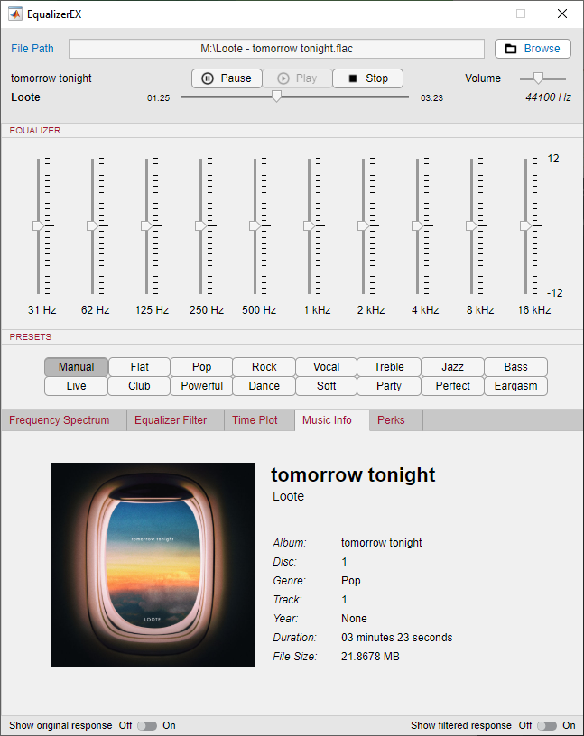

# EqualizerEX
A MATLAB based Real-time Audio Parametric Equalizer.

## Requirements
* MATLAB R2019A or MATLAB Runtime 9.6
* Python installed system-wide with the following modules:
    * scipy
    * numpy
    * mutagen
    * tinytag
* (Optional) Windows to run the included compiled binary

## License
You're free to modify and adapt this code to any of your project, whether for personal, educational or commercial use. An attribution to the original author and this page is not required, however you may feel free to do so. I won't be liable for any harm caused by the usage of this project nor shall be held responsible under any circumstances.

## Attribution
* Splash Screen and Icon https://pngtree.com/freepng/abtstract-sound-wave-equalizer.-trendy-gradient-color--electronic-sound-bar._3770563.html
* Play, Pause, Stop and Browse Icons https://material.io
